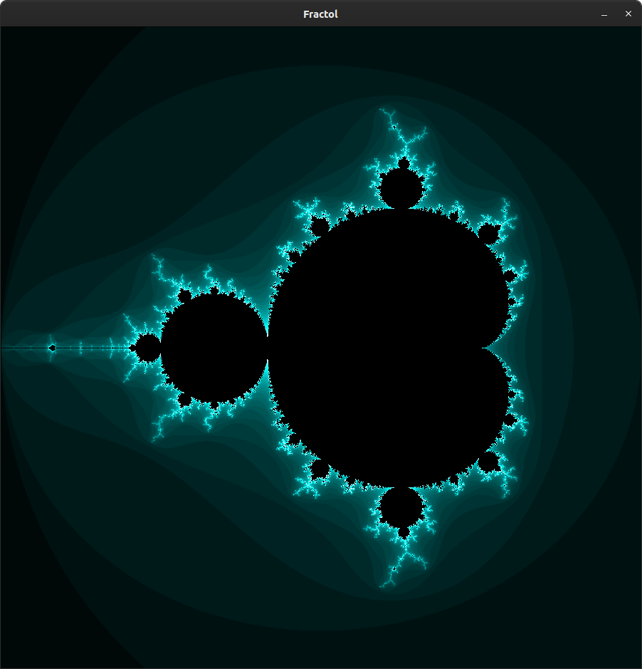

<a name="readme-top"></a>
<div align="center">
  <!-- Logo -->
  <a href="https://github.com/grigverdyan/42-cursus2024/fract-ol">
  
  </a>

  <!-- Project Name -->
  <h1>Fract-ol</h1>

  <!-- Short Description -->
  <p align="center">
	  <b>Visualizer of fractals in C</b><br>
  </p>

  <h3>
      <a href="#-about-project">📜 About Project</a>
    <span> · </span>
      <a href="#-fractals-list">📑 Fractals List</a>
    <span> · </span>
	  <a href="#-controls">🎮 Controls</a>
    <span> · </span>
      <a href="#-usage">👨‍💻 Usage</a>
    <span> · </span>
      <a href="#-screenshots">🌄 Screenshots</a>
  </h3>
</div>

---

## 📜 About Project

> One of the first graphical projects at 42 School, fract-ol generates beautiful fractals from the complex numbers of \
> an iterative mathematical construct. A fractal is a fragmented geometrical figure that infinitely repeats itself at \
> smaller scales. This project uses the school's graphical library, MiniLibX.

For detailed information, refer to the [**subject of this project**](en.subject.pdf).

	🚀 TLDR: The fract-ol project is one of the three "beginner" graphical projects of the 
 		 cursus. It teaches you about using graphic library, advanced math, and more.

> [!NOTE]  
> Because of 42 School norm requirements:
> * Each function can't have more than 25 lines of code.
> * All variables are declared and aligned at the top of each function.
> * Project should be created just with allowed functions otherwise it's cheating.

## 📑 Fractals List

The program supports these fractal sets:

| Name              | Formula                                                                                            |
|:-----------------:|:--------------------------------------------------------------------------------------------------:|
| Mandelbrot        | $z_{n+1} = z_n^2 + c, z_0 = 0$                                                                     |
| Julia             | $z_{n+1} = z_n^2 + c, z_0 = c$                                                                     |
| Burning Ship      | $z_{n+1} = abs(z_n^2) + c, z_0 = 0$                                                                |
| Tricorn           | $z_{n+1} = \frac{}{z_n}^2 + c, z_0 = 0$                                                            |
| Mandelbox         | It's more complex, see [this article](https://sites.google.com/site/mandelbox/what-is-a-mandelbox) |
| Celtic Mandelbar  | $z_{n+1} = \frac{}{z_n}^2 + c, z_0 = c$                                                            |

## 🎮 Controls

The program supports the following controls:

| Key           | Description                             |
|:-------------:|:---------------------------------------:|
| ESC           | Close the program window                |
| Keys [1-6]    | Move to another fractal                 |
| Keys [Q-Y]    | Change the color of fractal             |
| Keys [A-H]    | Change the color of fractal             |
| Mouse Scroll  | Zoom in and out of the fractal          |
| ⬆️ ⬇️ ⬅️ ➡️     | Change the viewpoint                    |
| Key L         | Lock Julia's fractal                    |
| Zero          | Reset the fractal to its initial state  |

## 👨‍💻 Usage
### Requirements

The program is written in C language and thus needs the **gcc compiler** and some standard **C libraries** to run.

### Instructions

**1. Compiling the program**

To compile the program, run:

```shell
$ cd path_to/fractol && make
```

**2. How to run the program**

Run the executable too see the help message:
```shell
./fractol
```

Or run with some supported fractal:
```shell
./fractol mandelbrot
```

# 🌄 Screenshots

## Mandelbrot set



## Julia set


## Burning Ship set


## Tricorn set


## Mandelbox set

